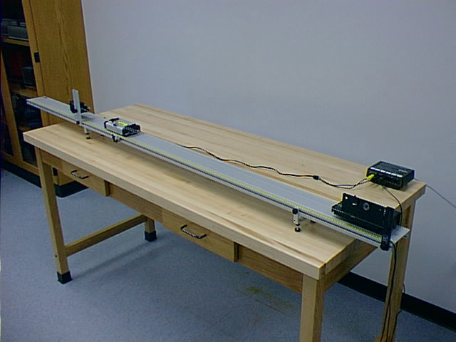

## Theory 
### What is Collision?

  

 

The abrupt change in path of a moving body (or bodies) due to its interaction with other body (or bodies) is called collision. The magnitude and direction of the velocity of the colliding bodies may change in a collision. The force involved in collision acts only for a very short period of time. We come across many examples of collision daily. The coins of a carom game colliding with one another or collision between vehicles in road etc, are examples of collision. The Conservation Laws applied here are;
Law of Conservation of Linear Momentum: Total linear momentum of a system of a particle is conserved if there is no external force acting on the system.
i.e., Total linear momentum before collision is equal to total linear momentum after collision, if no external force acts on the system.

Law of Conservation of Energy: Energy can neither be created nor destroyed. But can be converted from one form of energy into another. 

### Types of Collision:
 
1. **Elastic collision**: The type of collision in which both the momentum and kinetic energy of the system are conserved is called elastic collision. The collision between subatomic particles is generally elastic. The collision between two steel or glass balls is nearly elastic. In elastic collisions, the forces involving are conservative in nature.
2. **Inelastic collision**: The type of collision in which only momentum is conserved, not kinetic energy is called inelastic collision. Most of the collisions in daily life are inelastic in nature.

### Formulas Used:
 

In an elastic collision both kinetic energy and momentum are conserved. In the following equations, 1 and 2 indicate the two different objects colliding, unprimed variables indicates those before collision and primed variables indicate those after the collision, p is momentum, KE is kinetic energy, M is mass, and V is velocity.

 
### Conservation of Momentum:

$$p_{1}+p_{2}=p_{1}'+p_{2}'$$

$$M_{1}V_{1}+M_{2}V_{2}=M_{1}V_{1}'+M_{2}V_{2}'$$

$$KE_{1}+KE_{2}=KE_{1}'+KE_{2}'$$

$$or$$

$$\frac{1}{2}M_{1}V_{1}^{2}+\frac{1}{2}M_{2}V_{2}^{2}=\frac{1}{2}M_{1}(V_{1}')^{2}+\frac{1}{2}M_{2}(V_{2}')^{2}$$

$$V_{1}'=\frac{M_{1}-M_{2}}{M_{1}+M_{2}}V_{1}+\frac{2M_{2}}{M_{1}+M_{2}}V_{2}$$

And
$$V_{2}'=\frac{2M_{1}}{M_{1}+M_{2}}V_{1}+\frac{M_{2}-M_{1}}{M_{1}+M_{2}}V_{2}$$

If $M_{1}=M_{2}$ then $V_{1}'=V_{2}$ and $V_{2}'=V_{1}$

If the second object had a velocity $V_{2} =0$ before the collision the equations become;

$$V_{1}'=\frac{M_{1}-M_{2}}{M_{1}+M_{2}}V_{1}$$

And
$$V_{2}'=\frac{2M_{1}}{M_{1}+M_{2}}V_{1}$$

If the objects stick together after the collision the collision is a **perfectly inelastic collision**. In such a collision the velocities of the two objects after the collision are the same. Only **momentum is conserved** in the inelastic collision, but kinetic energy is not.

Conservation of Momentum:

$$p_{1}+p_{2}=p_{1}'+p_{2}'$$

Or

$$M_{1}V_{1}+M_{2}V_{2}=M_{1}V_{1}'+M_{2}V_{2}'$$

Since V2 = 0 and V'1 = V'2 the above solved for the velocities after the collision becomes;

$$V_{1}'=V_{2}'=\frac{M_{1}V_{1}+M_{2}V_{2}}{M_{1}+M_{2}}$$

Another approach is to combine elastic and inelastic collisions equations into one equation using the concept of the coefficient of restitution. The coefficient of restitution is defined by the relation;

$$e=\frac{V_{2}'-V_{1}'}{V_{1}-V_{2}}$$

Where the coefficient of restitution for a perfectly elastic collision is e = 1 and for a perfectly inelastic collision is e = 0. The equation for the velocities after the collision becomes;

$$V_{1}'=\frac{M_{1}-eM_{2}}{M_{1}+M_{2}}V_{1}+\frac{(1+e)M_{2}}{M_{1}+M_{2}}V_{2}$$

$$V_{1}'=\frac{(1+e)M_{1}}{M_{1}+M_{2}}V_{1}+\frac{M_{2}-eM_{1}}{M_{1}+M_{2}}V_{2}$$

These two equations give the same results as obtained for the elastic collision if e=1 and for the inelastic collision if e=0.
